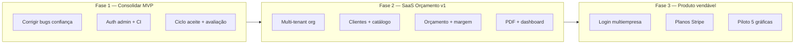

# Auditoria Técnica — CotaVisu

**Data:** 23 de junho de 2026  
**Responsável:** Cursor (CTO + PM + Dev Sênior)  
**Repositório:** [github.com/riks1301-ctrl/cotavisu](https://github.com/riks1301-ctrl/cotavisu)  
**Produção:** [cotavisu.vercel.app](https://cotavisu.vercel.app)  
**Status:** MVP marketplace em beta — base sólida, ciclo comercial incompleto

---

## 1. Resumo executivo

O CotaVisu **hoje é um marketplace/comparador B2B** de comunicação visual: compradores publicam pedidos, fornecedores enviam propostas e o comprador compara e aceita. A stack (Next.js 16 + Supabase + Vercel) é adequada para MVP com custo baixo.

A visão que você descreveu — **SaaS de orçamento e gestão comercial para gráficas** (clientes, produtos, materiais, margem, PDF, dashboard comercial, multiempresa) — é um produto **adjacente, mas diferente**. Parte da base reutiliza (categorias, especificações, fórmulas de preço, UX de pedido), mas o core de negócio precisa evoluir de *marketplace* para *ERP leve de orçamentos*.

**Prioridade imediata:** fechar o loop marketplace (notificações, aceite, confiança) **em paralelo** ao desenho do módulo SaaS de orçamento interno — sem quebrar o que já está no ar.

---

## 2. O que o sistema faz hoje

### Modelo de negócio atual
| Papel | O que faz |
|-------|-----------|
| **Comprador** | Cria pedido multi-etapas, recebe propostas, compara preço/prazo, aceita proposta |
| **Fornecedor** | Vê feed de pedidos abertos, envia proposta (preço, prazo, condições) |
| **Admin** | Gerencia serviços padrão e produtos de prateleira (modo estimativa) |
| **Visitante** | Navega landing, pedidos abertos e diretório de fornecedores sem login |

### Fluxos principais
1. **Criar pedido** (`/pedidos/novo`) — 6 etapas + fluxo PDV (kit múltiplo) + sugestão por IA (Claude Haiku)
2. **Comparar** (`/pedidos/[id]`) — propostas reais + estimativas “modo prateleira”
3. **Aceitar proposta** — API `POST /api/accept-proposal` com RPC transacional no Supabase
4. **Notificações** — `POST /api/notify-proposal` + Resend (nova proposta, novo pedido, proposta aceita)
5. **Auth** — cadastro comprador/fornecedor via Supabase Auth + tabela `profiles`

### Diferenciais já construídos
- **PDV com kit múltiplo** (wobbler, régua de gôndola, totem, etc.) — raro em concorrentes
- **Modo prateleira** — estimativas mesmo sem fornecedores ativos
- **Especificações ricas** por serviço (`lib/service-options.ts` — ~935 linhas)
- **IA opcional** para acelerar preenchimento do pedido

---

## 3. Stack e estrutura do projeto

### Stack
| Camada | Tecnologia |
|--------|------------|
| Framework | Next.js 16.2.7 (App Router, Turbopack) |
| UI | React 19, Tailwind CSS 4, shadcn/ui, lucide-react |
| Linguagem | TypeScript 5 |
| Banco + Auth | Supabase (PostgreSQL + Auth + RLS) |
| IA | Anthropic SDK (Claude Haiku) |
| E-mail | Resend |
| Deploy | Vercel |

### Estrutura de pastas (resumo)
```
app/                    # Rotas e páginas (App Router)
  api/                  # Route handlers (IA, notificação, aceite)
  admin/                # Painel admin
  cadastro, login, dashboard
  pedidos/, meus-pedidos/, fornecedores/
components/             # UI reutilizável (pdv-builder, price-cards, etc.)
lib/                    # auth, db, supabase, service-options, emails
supabase/               # schema.sql, migrations, RLS
public/                 # Assets estáticos
```

### Rotas / páginas
| Rota | Tipo | Função |
|------|------|--------|
| `/` | Server (revalidate 60s) | Landing + stats + pedidos recentes |
| `/login`, `/cadastro` | Client | Autenticação |
| `/dashboard` | Client | Painel por papel |
| `/pedidos` | Client | Feed de pedidos abertos |
| `/pedidos/novo` | Client | Formulário multi-step (~600 linhas) |
| `/pedidos/[id]` | Client | Detalhe + comparador + aceite |
| `/meus-pedidos` | Client | Pedidos do comprador logado |
| `/fornecedores` | Client | Diretório (dados reais do Supabase) |
| `/admin` | Client | CRUD modo prateleira |

### APIs
| Endpoint | Função |
|----------|--------|
| `POST /api/sugerir-pedido` | IA sugere categoria/serviço/medidas |
| `POST /api/notify-proposal` | E-mails transacionais |
| `POST /api/accept-proposal` | Aceite transacional + e-mail ao fornecedor |

### Banco de dados (Supabase)
Tabelas principais: `profiles`, `supplier_profiles`, `service_requests`, `proposals`, `reviews`, `service_categories`, `standard_services`, `shelf_products`, `shelf_estimates`.

### Variáveis de ambiente
Ver `.env.example` (criado nesta auditoria). Obrigatórias para produção:
- `NEXT_PUBLIC_SUPABASE_URL`, `NEXT_PUBLIC_SUPABASE_ANON_KEY`
- `SUPABASE_SERVICE_ROLE_KEY` (aceite e notificações server-side)
- `ANTHROPIC_API_KEY` (IA)
- `RESEND_API_KEY`, `RESEND_FROM_EMAIL` (e-mails)

### Scripts
```bash
npm run dev      # desenvolvimento
npm run build    # build produção
npm run start    # servidor produção
npm run lint     # ESLint
```
Não há suite de testes automatizados.

---

## 4. Ambiente local (auditoria 23/06/2026)

| Ação | Resultado |
|------|-----------|
| Clone do repositório | OK — workspace estava vazio; clonado de `riks1301-ctrl/cotavisu` |
| `npm install` | OK — 641 pacotes; 3 vulnerabilidades npm reportadas |
| `npm run lint` | **52 problemas** (32 erros, 20 warnings) |
| `npm run build` (sem env) | Falha — `supabaseUrl is required` |
| `npm run build` (com env placeholder) | Falha — Resend instanciado no top-level sem chave |
| Correção aplicada | `lib/emails/index.ts` — Resend lazy-init; `lib/supabase-admin.ts` — admin lazy-init |
| `npm run build` (após correção) | **OK** — 15 rotas geradas |

**Para rodar localmente:** copie `.env.example` → `.env.local` com credenciais reais do Supabase/Vercel.

---

## 5. O que está bom

### Produto
- Proposta de valor clara na landing (comparar orçamentos de comunicação visual)
- Formulário de pedido profundo para o segmento (materiais, laminação, PDV)
- Modo prateleira resolve cold start do marketplace
- Fluxo de aceite de proposta **implementado** com RPC + validação de ownership
- Módulo de e-mails transacionais estruturado (3 templates)
- Documentação interna útil: `ARQUITETURA.md`, `MARKETPLACE_FLOW.md`, `AUDITORIA_PROJETO/`

### Técnico
- Stack moderna e enxuta para MVP SaaS
- RLS habilitado desde o schema
- Separação razoável app/components/lib
- TypeScript em todo o projeto
- Deploy contínuo na Vercel funcionando
- UI consistente (shadcn, paleta azul, responsivo básico)

### UX/UI
- Landing profissional e confiável
- Mobile: menu hamburger, grids responsivos
- Feedback visual (loading, badges de status, urgência de prazo)
- Fluxo de cadastro simples (comprador vs fornecedor)

---

## 6. O que está fraco

### Gap estratégico (marketplace vs SaaS de orçamento)
O produto em produção **não possui** ainda:
- Cadastro de **clientes** da gráfica
- Catálogo **próprio** de produtos/serviços com custo e margem
- Composição de orçamento com **materiais + mão de obra + markup**
- **Geração de PDF** de proposta comercial
- **Dashboard comercial** (funil, conversão, ticket médio)
- **Status de orçamento** no sentido CRM (rascunho → enviado → negociando → ganho/perdido)
- **Multiempresa / multi-tenant**

Isso não é “falta de polish” — é **segundo produto** a construir sobre a mesma base técnica.

### Ciclo marketplace incompleto
- Avaliações: tabela e UI de estrelas existem, **fluxo pós-aceite não implementado**
- Promessas de “fornecedor verificado” e “CNPJ confirmado” sem processo operacional real
- Perfil de fornecedor limitado (sem CNPJ editável, portfólio, cidades atendidas na UI)
- Job de expiração de pedidos (`expires_at`) — sem cron no código
- Filtro geográfico no feed é **visual/ordenação**, não exclusão

### Código
- Uso extensivo de `any` em páginas críticas
- `lib/service-options.ts` monolítico (~935 linhas) — difícil evoluir para catálogo por empresa
- Dois clientes Supabase (`lib/supabase.ts` vs `lib/supabase-client.ts`) sem guia claro
- `lib/mock-data.ts` — código morto (não importado)
- `components/product-preview.tsx` — código morto
- **Sem `middleware.ts`** — rotas `/admin`, `/dashboard` sem proteção server-side
- Admin usa `supabase` server import em componente client — risco de auth inconsistente
- `notify-proposal` usa `SERVICE_ROLE_KEY ?? ANON_KEY` — fallback inseguro

### Qualidade / confiança na UI
- `price-cards.tsx` usa `Math.random()` no render — número de “pedidos similares” muda a cada re-render (**bug de confiança**)
- Cards de preço simulam “mais barato / mais rápido / melhor avaliado” com multiplicadores fixos — pode induzir decisão com dados fictícios
- Stats da home (“100+ empresas”, “4.8 avaliação”) podem exibir valores enganosos quando base é pequena
- Pedidos PDV aparecem com `m × m` na listagem (medidas null no banco)

### Testes e DevOps
- Zero testes automatizados
- Sem CI (lint/build) no repositório
- Migrations SQL manuais — risco de drift entre ambientes

---

## 7. Bugs encontrados

| # | Severidade | Descrição | Onde |
|---|------------|-----------|------|
| B1 | **Alta** | Build local falha sem `RESEND_API_KEY` (Resend no top-level) | `lib/emails/index.ts` — **corrigido nesta auditoria** |
| B2 | **Alta** | Build local falha sem variáveis Supabase | `lib/supabase.ts` — esperado; documentado em `.env.example` |
| B3 | **Média** | `Math.random()` em render altera texto “pedidos similares” | `components/price-cards.tsx:58` |
| B4 | **Média** | E-mail em `profiles` depende de migration não garantida no schema base | `migration-accept-proposal.sql` vs `schema.sql` |
| B5 | **Média** | Aceite de proposta busca `profiles.email` — coluna pode não existir se migration não rodou | `app/api/accept-proposal/route.ts` |
| B6 | **Média** | Admin importa client Supabase server-side em página client | `app/admin/page.tsx` |
| B7 | **Baixa** | `Date.now()` em render (lint react-hooks/purity) | `app/pedidos/page.tsx:141` |
| B8 | **Baixa** | Dados de teste visíveis em produção (“hdfgh” em descrição de adesivo) | Dados reais no Supabase prod |
| B9 | **Baixa** | `loadAll` antes de declarar (lint immutability) | `app/admin/page.tsx:40` |

---

## 8. Riscos técnicos

| Risco | Impacto | Probabilidade |
|-------|---------|---------------|
| RLS permissivo demais (`service_requests` leitura pública só por `status=open`) | Vazamento de pedidos fechados se política errada | Média |
| Admin sem auth server-side | Qualquer usuário acessa `/admin` se souber a URL | Alta |
| Service role key mal configurada | Operações privilegiadas falham ou usam anon key | Média |
| `service-options.ts` em código | Impossível SaaS multi-tenant sem refatoração | Alta (para sua visão) |
| Promessas LGPD/verificação sem processo | Risco jurídico e reputacional | Média |
| Supabase free tier | Limite de storage/DB com crescimento | Média |
| Dependência de IA sem rate limit | Custo/abuse na API Anthropic | Baixa |
| npm audit (3 vulnerabilidades) | Segurança de dependências | Baixa |

---

## 9. Avaliação por dimensão

### UX/UI — **7/10**
Boa landing e fluxo de pedido. Pontos fracos: formulário longo (6 etapas), dados simulados nos price cards, promessas de confiança não totalmente sustentadas.

### Responsividade — **7/10**
Grids e navbar mobile OK. Alguns formulários densos em telas pequenas.

### Performance — **6/10**
Home faz múltiplas queries Supabase. Urgency bar adiciona latência. Sem imagens otimizadas locais para categorias. ISR parcial (revalidate 60s).

### Segurança — **5/10**
RLS existe mas rotas admin desprotegidas, fallback anon em API, sem middleware, muitos `any`. Aceite de proposta bem implementado (Bearer + RPC).

### Organização do código — **6/10**
Estrutura clara, mas arquivos gigantes (`pedidos/novo`, `service-options`), código morto, duplicação de lógica de estimativa (db.ts vs pedidos/[id]).

### Regras de orçamento — **5/10 (marketplace)** / **1/10 (SaaS desejado)**
Fórmulas básicas (área, unit, area_min1m2) no modo prateleira. **Sem margem, custo de material, impostos, desconto, composição de itens** para orçamento interno da gráfica.

### Fluxo comercial — **6/10**
Criar pedido → proposta → aceite existe. Falta: CRM, follow-up, PDF, pipeline de status, avaliação pós-negócio.

### Prontidão SaaS vendável — **4/10**
Marketplace beta utilizável. Para SaaS B2B de orçamento (sua meta), falta ~70% do core.

---

## 10. Melhorias prioritárias

### P0 — Estabilidade e confiança (1–2 semanas)
1. Corrigir `price-cards` (remover `Math.random`, deixar explícito que é estimativa)
2. Proteger `/admin` com middleware + role `admin`
3. Garantir migration `profiles.email` aplicada em produção
4. Unificar cliente Supabase + documentar uso server vs browser
5. Remover código morto (`mock-data.ts`, `product-preview.tsx`)
6. Adicionar CI: `lint` + `build` no GitHub Actions
7. Cron Supabase para expirar pedidos `open` após `expires_at`

### P1 — Fechar ciclo marketplace (2–4 semanas)
1. Fluxo de avaliação pós-aceite
2. Perfil editável do fornecedor (CNPJ, descrição, cidades, serviços)
3. Onboarding guiado fornecedor
4. Simplificar formulário de pedido (3 etapas principais)
5. Tipagem forte (eliminar `any` nas páginas críticas)
6. Testes E2E do fluxo pedido → proposta → aceite

### P2 — Fundação SaaS de orçamento (4–8 semanas) — **sua visão principal**
1. **Modelo multi-tenant:** `organizations`, `organization_members`, `organization_id` em todas as tabelas de negócio
2. **Módulo CRM:** `clients` (nome, CNPJ, contato, endereço)
3. **Catálogo:** `products`, `materials`, `costs`, `margin_rules`
4. **Orçamentos internos:** `quotes`, `quote_items`, status (`draft|sent|approved|lost`)
5. **Motor de preço:** custo material + processo + margem % + arredondamento
6. **PDF:** proposta com logo, itens, totais, validade, condições
7. **Dashboard comercial:** orçamentos do mês, taxa de conversão, ticket médio

### P3 — Escala e monetização (8+ semanas)
1. Planos e billing (Stripe)
2. Multiusuário por empresa (vendedor, financeiro, admin)
3. Matching inteligente pedido-fornecedor (se mantiver marketplace)
4. WhatsApp Business API (opcional, após volume)

---

## 11. Plano de evolução em fases



### Fase 1 — Consolidar o que existe (sem quebrar produção)
**Objetivo:** Marketplace confiável para primeiros 20 fornecedores reais.  
**Entregas:** bugs P0, avaliações, perfil fornecedor, expiração de pedidos, lint limpo nas rotas críticas.

### Fase 2 — MVP SaaS de orçamento para gráficas
**Objetivo:** Uma gráfica consegue criar orçamento profissional em &lt;10 min e exportar PDF.  
**Entregas:** org + clientes + produtos/materiais + margem + PDF + pipeline de status.  
**Decisão de produto:** marketplace e SaaS podem coexistir (dois módulos) ou o marketplace vira canal de aquisição para o SaaS.

### Fase 3 — Go-to-market
**Objetivo:** 5–10 empresas pagantes em piloto.  
**Entregas:** onboarding, suporte, billing, métricas de ativação, NPS.

---

## 12. Componentes principais

| Componente | Responsabilidade |
|------------|------------------|
| `components/pdv-builder.tsx` | Kit PDV multi-item |
| `components/price-cards.tsx` | Faixa de preço estimada (precisa correção) |
| `components/proposta-form.tsx` | Envio de proposta pelo fornecedor |
| `components/ai-suggestion.tsx` | Entrada por linguagem natural |
| `components/category-cards.tsx` | Cards visuais na home |
| `components/layout/navbar.tsx` | Navegação + sessão |
| `lib/service-options.ts` | Catálogo estático de serviços/atributos |
| `lib/db.ts` | Queries e estimativas server-side |
| `lib/emails/index.ts` | E-mails transacionais Resend |

---

## 13. Alterações feitas nesta auditoria

| Arquivo | Mudança |
|---------|---------|
| `lib/emails/index.ts` | Resend instanciado sob demanda — build não quebra sem `RESEND_API_KEY` |
| `lib/supabase-admin.ts` | **Novo** — cliente service_role lazy-init para APIs server-side |
| `app/api/accept-proposal/route.ts` | Usa `getSupabaseAdmin()` em vez de init no top-level |
| `app/api/notify-proposal/route.ts` | Idem; removido fallback inseguro para anon key |
| `.env.example` | Template de variáveis para desenvolvimento local |
| `AUDITORIA_CURSOR_COTAVISU.md` | Este relatório |

**Build local:** passa com `NEXT_PUBLIC_SUPABASE_URL` + `NEXT_PUBLIC_SUPABASE_ANON_KEY` (validado em 23/06/2026).

**Repositório clonado** de `https://github.com/riks1301-ctrl/cotavisu` para `C:\Users\uso\hubcotação` (workspace estava vazio).

---

## 14. Próximo passo recomendado

Antes de grandes refatorações, preciso da sua decisão de produto:

**Opção A — Evoluir marketplace** (comparador, como está hoje)  
**Opção B — Pivotar para SaaS de orçamento** (ferramenta interna da gráfica)  
**Opção C — Híbrido** (SaaS core + marketplace como canal)

Recomendação técnica: **Opção C em fases** — Fase 1 consolida marketplace; Fase 2 adiciona módulo de orçamento reutilizando `service-options` e formulários como base do catálogo.

Quando você confirmar a direção e compartilhar as credenciais `.env.local` (ou acesso Vercel/Supabase), executo Fase 1 com PRs pequenos, build verde e sem regressões.

---

*Documento gerado como baseline técnica. Atualizar a cada fase de entrega.*
